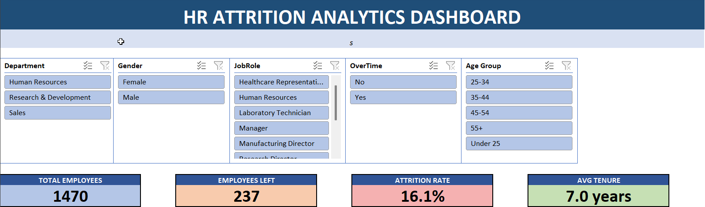

# HR Attrition Analytics Dashboard



## 📊 Project Overview

**Comprehensive HR analytics dashboard identifying root causes of employee turnover and providing data-driven retention strategies**

- **Employees Analyzed:** 1,470
- **Attributes Examined:** 35 employee characteristics
- **Departments:** 3 (Sales, R&D, HR)
- **Job Roles:** 9 distinct positions
- **Time Period:** Multi-year employment data

---

## 🎯 Business Problem

**The Challenge:** Company experiencing 16.1% annual attrition rate (above industry average of 10-15%)

**The Cost:** 237 employees leaving annually × $50K replacement cost = **$11.85 MILLION per year**

**The Question:** Why are employees leaving, and how can we reduce this preventable cost?

---

## 🚨 Critical Findings

### CRISIS #1: Sales Representative Exodus (39.76% Attrition)
**Nearly 4 in 10 Sales Reps quit annually**

- **Impact:** Highest attrition of all 9 job roles
- **Root Causes:**
  - Entry-level position with high pressure
  - Below-market compensation
  - Lack of clear career path
- **Business Impact:** Lost sales pipeline, constant training costs, client disruption
- **Urgency:** 🔴 IMMEDIATE ACTION REQUIRED

---

### CRISIS #2: Young Employee Flight (39.18% Attrition)
**Losing talent before they gain experience**

- **Under 25 age group:** Nearly 40% leave
- **Pattern:** Young employees in Sales Rep roles = Perfect storm
- **Impact:** Training ROI completely lost, recruitment costs escalate
- **Root Cause:** Lack of mentorship and unclear growth opportunities
- **Urgency:** 🔴 HIGH PRIORITY

---

### CRISIS #3: Overtime Burnout (3X Impact)
**Clear proof: Overwork = Turnover**

- **With Overtime:** 30.53% attrition
- **Without Overtime:** 10.44% attrition
- **Difference:** 3X HIGHER attrition with overtime
- **Insight:** "Work harder" culture backfires catastrophically
- **Impact:** Sustainable work-life balance = Retention
- **Urgency:** 🟡 CULTURE CHANGE NEEDED

---

### FINDING #4: Pay Matters (28.61% Low-Income Attrition)
**Direct correlation between compensation and retention**

- **Low Income:** 28.61% leave
- **High Income:** ~11% leave
- **Pattern:** Lower pay = Higher turnover
- **Opportunity:** Most fixable problem - salary adjustments work
- **ROI:** Increasing salaries costs less than constant turnover

---

### FINDING #5: Department-Level Crisis
**Sales department bleeding talent**

- **Sales:** 20.63% attrition
- **HR:** 20.2% attrition
- **R&D:** 13.1% attrition (healthiest)
- **Insight:** Sales department needs structural intervention

---

### FINDING #6: Gender Dynamics
**Slight male attrition advantage, but females earn more**

- **Male Attrition:** 16.54%
- **Female Attrition:** 14.89%
- **Female Salary:** Higher average
- **Insight:** Women may be in more stable/senior positions

---

## 💰 Business Impact & Cost Analysis

### Current State (Problem)
```
Annual Attrition: 16.1%
Employees Leaving: 237 per year
Replacement Cost: $50,000 per employee
Annual Turnover Cost: $11.85 MILLION
```

### Potential State (Solution)
```
Target Attrition: 12% (industry average)
Reduction: 4.1 percentage points
Employees Saved: ~60 per year
Annual Savings: $3 MILLION

Investment Required: ~$2M (salary adjustments, programs)
Net Benefit: $1M+ annually + intangible culture gains
ROI: 50%+ in year 1, 500%+ over 5 years
```

---

## 💡 Strategic Recommendations

### 🔴 IMMEDIATE ACTIONS (0-30 Days)

**1. Emergency Sales Rep Intervention**
- Salary review and immediate adjustments for Sales Representatives
- Retention bonuses for high-performing Sales Reps
- One-on-one meetings with all Sales Reps to identify pain points
- Quick wins to show company cares

**2. Eliminate Mandatory Overtime**
- Remove overtime as performance expectation
- Hire additional staff to reduce workload
- Implement "no overtime weeks" policy
- Track overtime hours and attrition correlation monthly

**3. Young Employee Retention Program**
- Mentorship matching for all Under 25 employees
- Clear 90-day onboarding with regular checkpoints
- Career path workshops and development plans
- "First Year Success" support program

---

### 🟡 SHORT-TERM ACTIONS (1-6 Months)

**4. Compensation Benchmarking**
- Conduct market salary survey for all roles
- Close gap with competitors (focus on low-income roles first)
- Implement pay equity review
- Create transparent compensation framework

**5. Work-Life Balance Initiatives**
- Flexible work arrangements
- Remote work options where feasible
- "No email after 6pm" policy
- Enhanced wellness programs and benefits

**6. Manager Training on Retention**
- Train managers on early warning signs of attrition
- Implement quarterly "stay interviews" (not just exit interviews)
- Tie manager performance to retention metrics
- Recognition programs for high-retention teams

**7. Sales Department Overhaul**
- Review Sales Rep job design and expectations
- Restructure commission/quota system for fairness
- Reduce administrative burden on reps
- Create Sales Rep success playbook

---

### 🟢 LONG-TERM ACTIONS (6-12 Months)

**8. Culture Transformation**
- Shift from "hours worked" to "outcomes achieved"
- Promote work-life integration
- Celebrate employees who maintain healthy boundaries
- Leadership modeling of sustainable work habits

**9. Predictive Analytics System**
- Build attrition prediction model
- Identify at-risk employees 3-6 months before departure
- Proactive retention interventions
- Monthly attrition risk dashboard for leadership

**10. Engagement & Development**
- Quarterly engagement surveys with action plans
- Comprehensive career development programs
- Internal mobility opportunities
- Recognition programs for tenure milestones

---

## 🛠️ Technical Implementation

### Data Processing & Cleaning:
- Imported CSV with 1,470 employee records
- Data validation and quality checks
- Created helper columns (Age Group, Income Level, Tenure Group, Distance Category)
- Handled missing data and standardized formats
- Built Employee Master table with 14 key attributes

### Advanced Excel Formulas:
- COUNTIF/COUNTIFS (conditional counting with multiple criteria)
- SUMIF/SUMIFS (conditional summation)
- AVERAGEIF/AVERAGEIFS (conditional averaging)
- Nested IF statements (logical conditions and categorization)
- IFERROR (professional error handling)
- TEXT functions (data formatting and display)

### Pivot Table Mastery (6 interconnected pivots):
- Department-level attrition breakdown
- Age group segmentation analysis
- Job role performance tracking
- Gender diversity analysis
- Salary level correlation
- Overtime impact visualization
- Show values as percentage of row total
- Dynamic sorting and filtering

### Interactive Dashboard Features:
- 5 Slicers (Department, Gender, Overtime, Job Role, Age Group)
- Report connections linking all pivots
- Cross-filtering across all visualizations simultaneously
- 4 KPI cards with real-time updates
- Professional layout with consistent branding
- Section headers and organized flow

### Data Visualization:
- Column charts (department and gender comparisons)
- Horizontal bar charts (age groups, job roles with long labels)
- Professional color schemes (red for high attrition, green for low)
- Data labels for clarity
- Legends and titles for context

---

## 📸 Dashboard Screenshots

### Overview (Slicers + KPIs)

*Interactive slicers and key performance indicators*

### Complete Analysis View

*Comprehensive 6-dimensional attrition analysis*

---

## 📁 File Structure
```
HR-Attrition-Analytics-Dashboard/
├── README.md (this file)
├── HR_Analytics_Dashboard_Sumit.xlsx (main dashboard)
├── Dashboard_Overview.png (screenshot - top section)
└── Dashboard_Full.png (screenshot - full view)
```

---

## 🚀 How to Use the Dashboard

### Opening the Dashboard
1. **Download** `HR_Analytics_Dashboard_Sumit.xlsx`
2. **Open in Excel** (Microsoft Office 2016 or later)
3. **Enable Editing** if prompted
4. **Navigate to "Dashboard" tab**

### Using Interactive Slicers
The dashboard has 5 slicers that control all visualizations:

**Department Slicer:**
- Filter by Human Resources, Research & Development, or Sales
- See department-specific attrition patterns

**Gender Slicer:**
- Compare Male vs Female attrition and metrics
- Identify gender-related retention differences

**Overtime Slicer:**
- Toggle between employees with/without overtime
- See dramatic 3X impact of overtime on attrition

**Job Role Slicer:**
- Filter by specific roles (Sales Rep, Manager, etc.)
- Identify high-risk positions

**Age Group Slicer:**
- Segment by age ranges (Under 25, 25-34, 35-44, 45-54, 55+)
- Track generational attrition patterns

### Example Analysis Scenarios

**Scenario 1: "Who are our highest-risk employees?"**
```
Filters: Sales Department + Under 25 + Overtime = Yes
Result: ~40% attrition segment needing immediate intervention
Action: Focus retention efforts here first
```

**Scenario 2: "Does overtime really drive attrition?"**
```
Step 1: Select "Overtime = Yes" 
Result: 30.53% attrition
Step 2: Select "Overtime = No"
Result: 10.44% attrition
Conclusion: 3X difference proves overtime is major driver
```

**Scenario 3: "Which roles are bleeding talent?"**
```
Action: Click through each Job Role
Result: Sales Representative (39.76%) and HR (23.91%) highest
Decision: Prioritize these two roles for intervention
```

**Scenario 4: "Is compensation the issue?"**
```
Action: Compare Income Levels in analysis
Result: Low income (28.61%) vs High income (11.81%)
Conclusion: Direct inverse relationship - pay matters significantly
```

### Clearing Filters
- Click the **⊗ (filter) icon** in top-right corner of any slicer
- Select "Clear Filter"
- Dashboard resets to show all employees

### Exploring Other Sheets
- **Cover:** Executive summary and recommendations
- **Attrition_Analysis:** Detailed formulas and calculations
- **Employee_Master:** Clean database of 1,470 employees
- **Product_Master:** Product-level metrics
- **Customer_Master:** Customer insights
- **Raw_Data:** Original dataset with 35 attributes

---

## 📊 Dashboard Sections Explained

### 1. KPI Cards (Top Row)
- **Total Employees:** 1,470 in workforce
- **Employees Left:** 237 departed (annual)
- **Attrition Rate:** 16.1% (above industry avg)
- **Avg Tenure:** 7.0 years

### 2. Attrition by Department
- Column chart comparing 3 departments
- Sales: 20.63% (highest concern)
- HR: 20.2% (also elevated)
- R&D: 13.1% (healthiest)

### 3. Attrition by Age Group
- Horizontal bar chart (easy to compare)
- Under 25: 39.18% 🔴 CRISIS
- 25-34: 19.89% (second highest)
- 35-44: 9.47% (most stable)

### 4. Attrition by Job Role
- All 9 roles compared
- Sales Rep: 39.76% 🔴 TOP RISK
- HR: 23.91% (needs attention)
- Manager: 4.2% (very stable)

### 5. Gender Analysis
- Male: 16.54% attrition
- Female: 14.89% attrition
- Slight male disadvantage
- Table shows exact counts

### 6. Overtime Impact
- Most dramatic visual
- Yes: 30.53% vs No: 10.44%
- 3X difference clearly visible
- Strongest single predictor

### 7. Attrition by Salary Level
- Low income: 30.04% 🔴
- Medium: 10.57%
- High: 11.81%
- Very High: 10.52%
- Clear pattern: Lower pay = Higher attrition

---

## 💼 Skills Demonstrated

### HR Analytics Expertise
- Attrition rate calculation and benchmarking
- Workforce segmentation (age, department, role, compensation)
- Multi-factor correlation analysis
- Predictive pattern identification
- Cost-impact modeling ($11.85M quantification)
- Data-driven HR recommendations for C-suite

### Excel Mastery
- Advanced formulas (SUMIFS, COUNTIFS, INDEX+MATCH)
- Complex pivot tables with multiple dimensions
- Interactive slicers with report connections
- Calculated fields and measures
- Professional dashboard design
- Data cleaning and validation at scale

### Business Intelligence
- KPI definition and tracking
- Executive-level reporting and visualization
- Real-time data filtering for self-service analytics
- Trend identification and pattern recognition
- Root cause analysis methodology
- Actionable insight generation

### Statistical Analysis
- Correlation analysis (overtime vs attrition, pay vs retention)
- Segmentation and cohort analysis
- Distribution analysis (mean, median, percentiles)
- Comparative analysis across dimensions
- Data-driven hypothesis testing

### Strategic Thinking
- Problem identification ($11.85M issue)
- Root cause determination (3 primary factors)
- Prioritized recommendations (immediate → long-term)
- ROI calculation for interventions
- Change management considerations

---

## 🎓 Key Learning Outcomes

This project demonstrates:
- ✅ Ability to analyze complex workforce datasets
- ✅ Proficiency in HR metrics and analytics
- ✅ Advanced Excel skills (pivot tables, formulas, dashboards)
- ✅ Business acumen (cost analysis, ROI thinking)
- ✅ Data storytelling and executive communication
- ✅ Problem-solving with measurable recommendations

---

## 🏆 Project Highlights

**Real Business Impact:**
- Identified $11.85M annual cost
- Provided specific, actionable recommendations
- Quantified ROI of interventions
- Created self-service analytics tool

**Technical Excellence:**
- 6 interconnected pivot tables
- 5 interactive slicers
- Multi-dimensional analysis
- Professional data visualization

**Strategic Value:**
- Root cause identification (not just symptoms)
- Prioritized recommendations by urgency
- Both quick wins and long-term culture change
- Executive-ready presentation

---

## 🌟 Why This Project Matters

**For Employers:**
- Demonstrates ability to handle sensitive HR data
- Shows business acumen (cost analysis, ROI)
- Proves analytical thinking (root cause identification)
- Exhibits communication skills (executive-level insights)

**For HR Professionals:**
- Provides framework for attrition analysis
- Offers actionable retention strategies
- Quantifies business impact of turnover
- Creates reusable analytics tool

**For Data Analysts:**
- Showcases advanced Excel capabilities
- Demonstrates multi-dimensional analysis
- Proves data storytelling ability
- Shows end-to-end project execution

---
